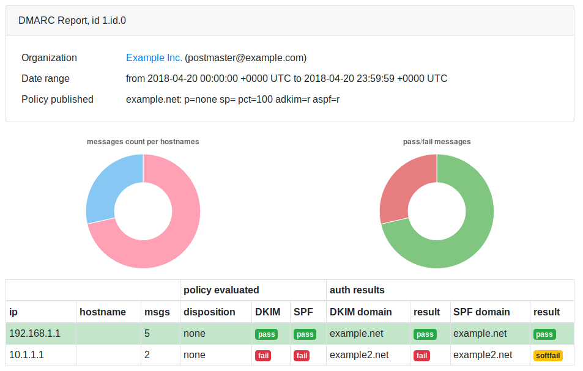

dmarc-report-converter
======================

Convert DMARC reports from xml to human-readable formats.

Example of html output:


Support inputs:

* **.xml** file: dmarc report in xml format

* **.gz** file: gzipped dmarc report in xml format

* **.zip** file: zipped dmarc report in xml format

* **imap**: connect to imap server and download emails. If attachments contains **.xml**, **.gz** or
  **.zip**, try to convert them

Support output formats:

* **html** output file is the html, generated from template templates/html.gotmpl

* **html_static** output file is the html, generated from template templates/html_static.gotmpl

* **txt** output file is the plain text, generated from template templates/txt.gotmpl

* **json** output file is the json

Configuration
-------------

Copy config/config.dist.yaml to config.yaml and change parameters:

* input: choose and configure **dir** OR **imap**. If **delete: yes**, delete source
  files after converting (with configured imap, delete source emails)

* output: choose format and file name template. If **file** empty string "" or "stdout", print
  result to stdout.

* lookup_addr: perform reverse lookup? If enabled, may take some time.

Installation
------------

1. download pre-builded archive from releases or build dmarc-report-converter executable:
  ```bash
  go get -u github.com/tierpod/dmarc-report-converter
  cd $HOME/go/src/github.com/tierpod/dmarc-report-converter
  make bin/dmarc-report-converter
  ```

  now you can run ./bin/dmarc-report-converter and test it

2. copy bin/dmarc-report-converter executable to installation directory (for example, /opt/dmarc-report-converter)

3. copy config/config.dist.yaml to installation directory, rename it and edit

4. copy templates directory to installation directory, edit if necessery
  ```bash
  # steps 2-4:
  sudo make install
  ```

5. add crontab daily job or systemd service unit + systemd timer unit (see examples in "install" directory)

Thanks
------

* [bootstrap](https://getbootstrap.com/)
* [jquery](http://jquery.com/)
* [ChartJS](http://chartjs.org/)
* [golang emersion packages](https://github.com/emersion) (go-imap, go-message, go-sasl, go-textwrapper)
