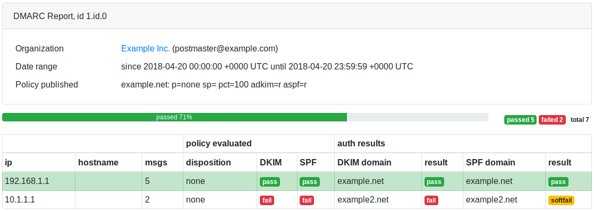

dmarc-report-converter
======================

⚠️ this repo has been forked from https://github.com/tierpod/dmarc-report-converter I've bumped a couple of dependencies and slightly reworked the IMAP
client to better handle exceptions. These modifications will end up eventually in the upstream repo.

Convert DMARC report files from xml to human-readable formats. Files can be located on a local
filesystem or on an IMAP server.

Example of html_static output:


Support input formats:

* **.xml** file: dmarc report in xml format

* **.gz** file: gzipped dmarc report in xml format

* **.zip** file: zipped dmarc report in xml format

Support output formats:

* **html_static** output file is the html, generated from template templates/html_static.gotmpl.
  This format uses bootstrap hosted on bootstrapcdn, so you don't need to configure self-hosted
  bootsrap assets.

* **html** output file is the html, generated from template templates/html.gotmpl.
  This format uses self-hosted bootsrap and javascript assets, so you need to configure your web
  server and *output -> assets_path* option.

* **txt** output file is the plain text, generated from template templates/txt.gotmpl

* **json** output file is the json

Installation
------------

1. Get installation archive. There are two ways: download pre-builded archive from
   [github releases](https://github.com/tierpod/dmarc-report-converter/releases) page or
   [build from sources](#building-from-sources)

2. Unpack to destination directory, for example to "/opt":

   ```bash
   sudo tar -xvf dmarc-report-converter*.tar.gz -C /opt
   ```

3. Copy example config file and [edit](#configuration):

   ```bash
   cd /opt/dmarc-report-converter/
   sudo cp config.dist.yaml config.yaml
   sudo nano config.yaml
   ```

4. If you want to use "html" output, you have to configure your web server to serve **assets**
   directory and change assets_path in configuration file. Example for nginx:

   ```bash
   sudo cp -r assets /usr/share/nginx/html
   ```

   config.yaml:

   ```yaml
   output:
     assets_path: "/dmarc/assets"
   ```

   location configuration:

   ```nginx
   location /dmarc/ {
       root /usr/share/nginx/html;
       autoindex           on;
       autoindex_localtime on;
   }
   ```

    and go to the http://your-web-server/dmarc

Configuration
-------------

Copy config/config.dist.yaml to config.yaml and change parameters:

* **lookup_addr** (bool): perform reverse lookup? If enabled, may take some time.

* **merge_reports** (bool): merge multiple similar reports to one?

* **log_debug** (bool): print debug log messages?

* **log_datetime** (bool): add datetime to log messages?

**input** section:

* **dir** (str): directory with input files

* **delete** (bool): delete source files after conversion?

* **imap** *(optional section)*: dmarc-report-converter can fetch reports from IMAP server and save
  them to **input -> dir** before conversion started. To achieve this, configure this subsection.

  * **server**, **username**, **password**, **mailbox** (str): IMAP server address, credentials and
    mailbox name

  * **delete** (bool): delete email messages from IMAP server if reports are fetched successfully

  * **debug** (bool): print debug messages during IMAP session?

**output** section:

* **file** (str): output file, should be string or golang template. If value is empty string *""* or
  *"stdout"*, print result to stdout. Inside golang template any field from *dmarc.Report* struct
  can be used, or shortcuts *.ID*, *.TodayID*

* **format** (str): output format (txt, json, html_static, html)

* **assets_path** (str, *optional for html*): path to assets for html output format.

Daily reports
--------------

If you want to convert reports daily:

* Set **input -> delete: yes** and **input -> imap -> delete: yes**, because all old reports should
  be deleted from the source

* Set **merge_reports: no** (do not merge any reports, use as-is)

* Execute dmarc-report-converter every day (add daily crontab job or systemd timer):

  ```bash
  sudo cp install/dmarc-report-converter.sh /etc/cron.daily/
  ```

* Use **{{ .ID }}** or **{{ .TodayID }}** shortcut in **output -> file**

Weekly or monthly reports
-------------------------

Many providers send reports to your email address every day. If you want to make weekly or monthly
reports:

* Set **input -> delete: yes** and **input -> imap -> delete: yes**, because all old reports should
  be deleted from the source

* Set **merge_reports: yes**, because all similar reports should be merged

* Execute dmarc-report-converter every **week** / **month** (add weekly / monthly crontab job or
  systemd timer)

* Use **{{ .TodayID }}** shortcut in **output -> file**, if you want to create output file with
  current date in filename (instead of begin report date).

Building from sources
---------------------

1. Install go compiler and building tools:

   ```bash
   # debian/ubuntu
   sudo apt-get install golang-go make git tar

   # centos/fedora, enable epel-release repo first
   sudo yum install epel-release
   sudo yum install golang make git tar
   ```

   or follow [official instruction](https://golang.org/dl/)

2. Download sources:

   ```bash
   go get -u github.com/tierpod/dmarc-report-converter
   ```

3. Build binary and create installation archive:

   ```bash
   cd $HOME/go/src/github.com/tierpod/dmarc-report-converter
   make release
   ```

4. Installation archive will be places inside _release_ directory. Also, if you want to test
   dmarc-report-converter without installation, you can execute:

   ```bash
   ./bin/dmarc-report-converter -config /path/to/config.yaml
   ```

Thanks
------

* [bootstrap](https://getbootstrap.com/)
* [jquery](http://jquery.com/)
* [ChartJS](http://chartjs.org/)
* [golang emersion packages](https://github.com/emersion) (go-imap, go-message, go-sasl, go-textwrapper)
